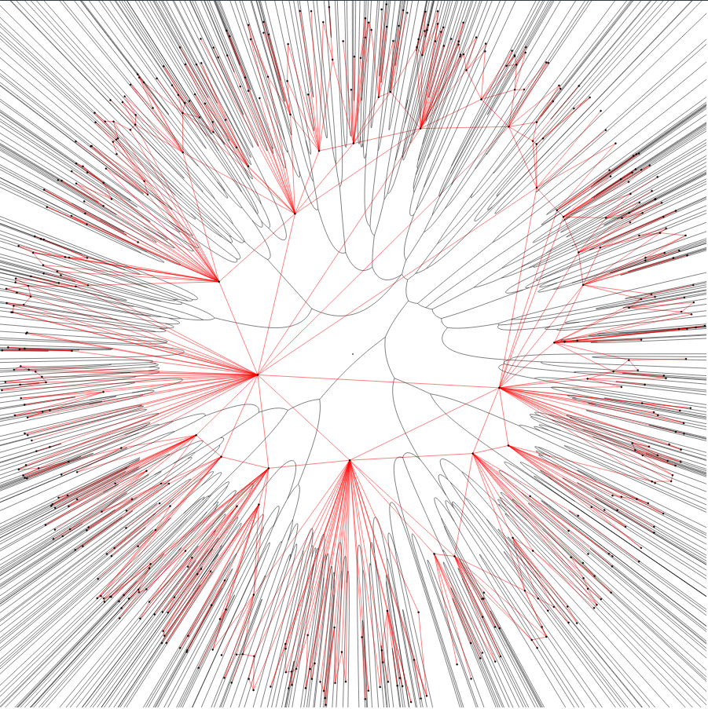

# Fortune's Algorithm in Hyperbolic Space

This is an implementation of Fortune's Algorithm in the polar coordinate model of hyperbolic space. Based
on [this](https://www.researchgate.net/publication/356817081_Computing_Voronoi_Diagrams_in_the_Polar-Coordinate_Model_of_the_Hyperbolic_Plane) paper.



## How to use

This is a header only library that you can easily include to your project. Place the `fortune-hyperbolic` folder
 into a directory of your choice and include it in your `CMakeLists.txt` with

```cmake
list(APPEND CMAKE_PREFIX_PATH <path/to/fortune-hyperbolic>)
find_package(Fortune_Hyperbolic)

target_include_directories(<your_target> PRIVATE ${Fortune_Hyperbolic_INCLUDE_DIRS})
target_link_libraries(<your_target> PRIVATE ${Fortune_Hyperbolic_LIBRARIES})
```

High precision floating point values from boost and MPFR are supported. If you wish to use these, set the 
CMake variable `FORTUNE_USE_MPFR` to `TRUE`.

This directory contains a sample application that computes and draws a Voronoi Diagram. See 
[CMakeLists.txt](CMakeLists.txt) for an example using MPFR. You need boost and MPFR installed for this.

### Code Example

The following program allows you to compute a Voronoi Diagram from a set of sites

```c++
#include <geometry.hpp>
#include <utils.hpp>
#include <kernels.hpp>
#include <fortune.hpp>

#include <vector>

using namespace hyperbolic;
using floating_point_type = double;

int main() {
    // calculate the diagram
    VoronoiDiagram v;
    vector<Point<double>> sites = {
            {3, 2.43},
            {2, 2.19},
            {6, 0.87},
            {9.2, 1.23}
    };
    FortuneHyperbolicImplementation
            <FullNativeKernel<floating_point_type>, floating_point_type> 
            fortune(v, sites);
    fortune.calculate();
    
    // draw the diagram
    VoronoiCanvas canvas(v, sites);
    canvas.draw_diagram("out.svg");
}
```

## How to Build

We use CMake. To build this project on UNIX, simply use 

```shell
mkdir build
cd build
cmake ..
cmake --build .
```